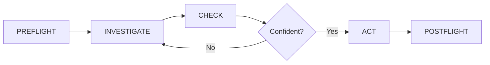

# Documentation Plan for v1.0 Release

**Date:** 2025-11-15  
**Status:** Planning Phase  
**Owner:** Claude (Co-lead) + Human (Lead)  
**Parallel Work:** Minimax + Qwen doing code hardening

---

## 🎯 Goals

1. **Professional documentation** suitable for a foundational system
2. **Clear onboarding** for new users and developers
3. **Complete API reference** for all features
4. **Searchable website** with good UX
5. **Release-ready** by November 20, 2025

---

## 📊 Current Documentation State

### What We Have ✅
- ✅ README.md (updated with Phase 1.5)
- ✅ Canonical references (CANONICAL_DIRECTORY_STRUCTURE.md, ARCHITECTURE_OVERVIEW.md)
- ✅ Production docs (docs/production/ - 20 files)
- ✅ Guides (docs/guides/ - 15+ files)
- ✅ Architecture docs (docs/architecture/ - 16 files)
- ✅ Vision docs (docs/vision/ - 8 files)
- ✅ Validation reports (6 reports from Qwen)

### What Needs Work ⚠️
- ⚠️ Production docs need Phase 1.5 updates
- ⚠️ Need unified navigation structure
- ⚠️ Need searchable website
- ⚠️ Need visual diagrams
- ⚠️ Need video/animated guides (future)

---

## 📚 Documentation Structure (Website)

### Proposed Site Structure

```
empirica.dev/ (or GitHub Pages)
│
├── Home (index.md)
│   ├── Hero section
│   ├── Key features
│   ├── Quick start
│   └── Validation metrics
│
├── Getting Started/
│   ├── Installation
│   ├── Quick Start (5 minutes)
│   ├── First Session
│   └── Basic Concepts
│
├── Core Concepts/
│   ├── Epistemic Vectors (13 vectors explained)
│   ├── CASCADE Workflow (PREFLIGHT → POSTFLIGHT)
│   ├── Calibration (measuring growth)
│   ├── Goal Orchestration (LLM vs threshold)
│   └── Git Checkpoints (Phase 1.5)
│
├── User Guides/
│   ├── Self-Referential Goals (llm_callback)
│   ├── Git Checkpoints (97.5% reduction)
│   ├── Investigation Strategies
│   ├── MCP Integration
│   ├── Multi-Agent Coordination
│   └── Session Resumption
│
├── API Reference/
│   ├── Bootstrap API
│   │   ├── bootstrap_metacognition()
│   │   ├── OptimalMetacognitiveBootstrap
│   │   └── Parameters reference
│   ├── CASCADE API
│   │   ├── execute_preflight()
│   │   ├── execute_check()
│   │   ├── execute_postflight()
│   │   └── Full workflow
│   ├── MCP Tools (21 tools)
│   │   ├── Session management
│   │   ├── Epistemic tracking
│   │   ├── Goal orchestration
│   │   └── Git checkpoints
│   ├── Database API
│   │   ├── SessionDatabase
│   │   ├── Query methods
│   │   └── Checkpoint methods
│   └── Components API
│       ├── Epistemic Assessment
│       ├── Goal Orchestrator
│       ├── Reflex Logger
│       └── Token Efficiency
│
├── Validation/
│   ├── Session Results (73 sessions)
│   ├── Token Efficiency (97.5% reduction)
│   ├── Calibration Studies
│   ├── Performance Metrics (Qwen's reports)
│   └── Multi-Agent Validation
│
├── Examples/
│   ├── Basic Usage
│   ├── Advanced Patterns
│   ├── Real-World Scenarios
│   ├── Multi-Agent Setup
│   └── Custom Investigations
│
├── Development/
│   ├── Architecture Overview
│   ├── Contributing Guide
│   ├── Code Conventions (NEW - from hardening)
│   ├── Testing Guide
│   └── Plugin Development
│
└── About/
    ├── Vision & Philosophy
    ├── Research Background
    ├── Changelog
    ├── License
    └── Community
```

---

## 🎨 Website Platform Decision

### Option 1: MkDocs + Material Theme (RECOMMENDED)
**Pros:**
- ✅ Beautiful, modern design
- ✅ Built-in search
- ✅ Easy to maintain (Markdown)
- ✅ Can deploy to GitHub Pages automatically
- ✅ Versioning support (for v1.1, v1.2, etc.)
- ✅ Code highlighting excellent
- ✅ Mobile-responsive

**Cons:**
- ⚠️ Requires Python (but we have it)
- ⚠️ Need to configure properly

**Example config (mkdocs.yml):**
```yaml
site_name: Empirica
site_description: Metacognitive framework for AI agents with genuine self-awareness
site_url: https://empirica.dev

theme:
  name: material
  palette:
    scheme: slate
    primary: deep purple
    accent: purple
  features:
    - navigation.instant
    - navigation.tracking
    - navigation.tabs
    - navigation.sections
    - navigation.expand
    - navigation.indexes
    - toc.follow
    - toc.integrate
    - search.suggest
    - search.highlight
    - content.code.annotate
    - content.code.copy

plugins:
  - search
  - git-revision-date-localized

nav:
  - Home: index.md
  - Getting Started:
    - Installation: getting-started/installation.md
    - Quick Start: getting-started/quick-start.md
    - First Session: getting-started/first-session.md
  - Core Concepts:
    - Epistemic Vectors: core-concepts/epistemic-vectors.md
    - CASCADE Workflow: core-concepts/cascade-workflow.md
    - Calibration: core-concepts/calibration.md
  # ... etc
```

**Setup time:** 2-3 hours  
**Deployment:** Automatic via GitHub Actions

---

### Option 2: Docusaurus (Alternative)
**Pros:**
- ✅ Modern, feature-rich
- ✅ React-based (extensible)
- ✅ Versioning built-in
- ✅ Search included

**Cons:**
- ⚠️ Requires Node.js
- ⚠️ More complex setup
- ⚠️ Overkill for our needs?

**Setup time:** 4-5 hours

---

### Option 3: Simple Static Site (Minimal)
**Pros:**
- ✅ Lightweight
- ✅ Complete control

**Cons:**
- ❌ No search built-in
- ❌ More work to maintain
- ❌ Less professional

**Not recommended for foundational project**

---

### Decision: MkDocs + Material Theme ⭐

**Rationale:**
- Best balance of features vs simplicity
- Perfect for technical documentation
- Python-based (fits our stack)
- Professional appearance
- Can be deployed today

---

## 📝 Content Updates Needed

### High Priority (Before Launch)

#### 1. Update Production Docs with Phase 1.5
**Files to update:**
- `docs/production/00_COMPLETE_SUMMARY.md` - Add Phase 1.5 section
- `docs/production/03_BASIC_USAGE.md` - Add git checkpoints example
- `docs/production/13_PYTHON_API.md` - Add llm_callback API
- `docs/production/19_API_REFERENCE.md` - Add checkpoint methods
- `docs/production/20_TOOL_CATALOG.md` - Add git checkpoint tools

**Estimated:** 2-3 hours

---

#### 2. Create Missing Guides
**New guides needed:**
- `docs/guides/GIT_CHECKPOINTS_GUIDE.md` - How to use Phase 1.5
- `docs/guides/SELF_REFERENTIAL_GOALS.md` - Using llm_callback
- `docs/guides/MULTI_AGENT_SETUP.md` - Coordinating multiple agents
- `docs/guides/SESSION_RESUMPTION.md` - Using git checkpoints to resume

**Estimated:** 3-4 hours

---

#### 3. Create Visual Diagrams
**Diagrams needed:**
- CASCADE workflow flowchart
- System architecture diagram
- Git checkpoint flow
- Multi-agent coordination diagram
- Vector relationship diagram

**Tools:** Mermaid.js (renders in Markdown)

**Example:**


**Estimated:** 2-3 hours

---

#### 4. Create CHANGELOG.md
**Content:**
```markdown
# Changelog

## [1.0.0] - 2024-12-01

### Added
- Self-referential goal generation via llm_callback interface
- Git-enhanced context loading (97.5% token reduction - Phase 1.5)
- 5 CLI checkpoint commands
- Automatic checkpointing in CASCADE workflow
- SessionDatabase git checkpoint integration
- 21 MCP tools for epistemic tracking
- Complete CASCADE workflow (7 phases)
- 13-vector epistemic assessment framework
- Multi-agent coordination support
- Comprehensive validation (73 sessions)

### Changed
- Goal orchestrator now supports both LLM and threshold modes
- Bootstrap simplified with profile-based configuration
- Documentation reorganized for clarity

### Fixed
- Database connection handling
- CLI duplicate profile parser calls
- Missing --quiet arguments in CLI commands
- SessionDatabase parameter naming conflicts

### Performance
- 97.5% token reduction in context loading (validated)
- 0.59s average per CASCADE session
- 0.23 MB per cascade instance
- Handles 100+ concurrent instances

### Validated
- llm_callback with real LLM ✅
- Investigation strategies ✅
- Full CASCADE integration ✅
- Performance at scale ✅
- Multi-agent coordination ✅
```

**Estimated:** 1 hour

---

### Medium Priority (Post-Launch)

#### 5. Video Tutorials
- Quick start video (5 min)
- CASCADE workflow walkthrough (10 min)
- Phase 1.5 demonstration (5 min)

**Estimated:** 4-6 hours (future)

---

#### 6. Interactive Examples
- Jupyter notebooks
- Colab notebooks
- Live demos

**Estimated:** 6-8 hours (future)

---

## 🚀 Implementation Plan

### Phase 1: Content Preparation (2-3 days)
**Owner:** Claude (Me)

**Tasks:**
1. Update production docs with Phase 1.5 (3 hours)
2. Create new guides (4 hours)
3. Create visual diagrams (3 hours)
4. Create CHANGELOG.md (1 hour)
5. Review all documentation for accuracy (2 hours)

**Total:** ~13 hours

**Deliverable:** All content ready for website

---

### Phase 2: Website Setup (1 day)
**Owner:** Claude (Me) + Human (Review/Deploy)

**Tasks:**
1. Install MkDocs + Material theme (30 min)
2. Create mkdocs.yml configuration (1 hour)
3. Convert/organize content for website (2 hours)
4. Set up GitHub Actions for auto-deploy (1 hour)
5. Test website locally (30 min)
6. Deploy to GitHub Pages (30 min)

**Total:** ~5-6 hours

**Deliverable:** Live website at empirica.dev or username.github.io/empirica

---

### Phase 3: Polish & Launch (1 day)
**Owner:** Both

**Tasks:**
1. Final content review (2 hours)
2. Fix any broken links (1 hour)
3. Test all examples (1 hour)
4. Add search functionality test (30 min)
5. Mobile responsiveness check (30 min)
6. Launch! (1 hour)

**Total:** ~5 hours

**Deliverable:** Production-ready documentation website

---

## 📊 Content Inventory

### Existing Content Quality

**Excellent (Use as-is):**
- ✅ CANONICAL_DIRECTORY_STRUCTURE.md
- ✅ ARCHITECTURE_OVERVIEW.md
- ✅ README.md
- ✅ Validation reports (Qwen)

**Good (Minor updates):**
- ⚠️ docs/production/01_QUICK_START.md
- ⚠️ docs/production/05_EPISTEMIC_VECTORS.md
- ⚠️ docs/production/06_CASCADE_FLOW.md
- ⚠️ docs/guides/EMPIRICA_QUICK_PROMPTS.md

**Needs Updates (Phase 1.5):**
- ⚠️ docs/production/00_COMPLETE_SUMMARY.md
- ⚠️ docs/production/13_PYTHON_API.md
- ⚠️ docs/production/19_API_REFERENCE.md
- ⚠️ docs/production/20_TOOL_CATALOG.md

**Create New:**
- 🆕 docs/guides/GIT_CHECKPOINTS_GUIDE.md
- 🆕 docs/guides/SELF_REFERENTIAL_GOALS.md
- 🆕 docs/guides/MULTI_AGENT_SETUP.md
- 🆕 CHANGELOG.md
- 🆕 CONVENTIONS.md (from hardening work)

---

## 🎯 Success Metrics

### Documentation Quality
- ✅ All features documented
- ✅ All API endpoints documented
- ✅ Examples for common use cases
- ✅ Troubleshooting guides
- ✅ Clear navigation

### Website Quality
- ✅ Fast load times (<2s)
- ✅ Mobile responsive
- ✅ Search works well
- ✅ Professional appearance
- ✅ Easy to navigate

### User Experience
- ✅ New user can get started in <10 minutes
- ✅ All common questions answered
- ✅ Examples are copy-paste ready
- ✅ Clear next steps after each page

---

## 💡 Parallel Work Strategy

### While Minimax + Qwen Do Hardening (2 days)
**I (Claude) will:**
1. Day 1: Update production docs + create new guides
2. Day 2: Create diagrams + set up website

**Result:** When hardening is complete, docs are ready

### When Hardening Complete
**Add to docs:**
- CONVENTIONS.md (from Minimax's consistency work)
- Security best practices (from Qwen's audit)
- Edge case documentation (from Qwen's testing)

---

## 📅 Timeline

**November 15 (Today):**
- ✅ Hardening tasks assigned to Minimax + Qwen
- ✅ Documentation plan created (this doc)
- 🔄 Start content updates

**November 16-17:**
- Content updates complete
- Website setup complete
- Hardening work complete

**November 18:**
- Final polish
- Deploy website
- Final testing

**November 19-30:**
- Marketing preparation
- Community engagement
- Final QA

**December 1:**
- 🚀 **LAUNCH v1.0**

---

## 🆘 Risks & Mitigation

### Risk 1: Content Takes Longer Than Expected
**Mitigation:** 
- Prioritize critical docs first
- Can launch with "good enough" and improve post-release
- Phase 1.5 docs are most critical (new feature)

### Risk 2: Website Deployment Issues
**Mitigation:**
- Test locally first
- Have fallback: just use GitHub README + docs/ folder
- MkDocs is well-documented

### Risk 3: Hardening Finds Major Issues
**Mitigation:**
- That's the point! Better now than after launch
- Can delay launch if critical issues found
- Most likely: minor issues easily fixed

---

## ✅ Next Actions

### Immediate (Now)
1. ✅ Push this plan to git
2. ⏳ Start updating production docs
3. ⏳ Create Phase 1.5 guides

### Today
1. Update docs/production/00_COMPLETE_SUMMARY.md
2. Update docs/production/13_PYTHON_API.md
3. Create docs/guides/GIT_CHECKPOINTS_GUIDE.md

### This Week
1. Complete all content updates
2. Set up website
3. Review hardening results

---

**Documentation plan complete. Ready to execute in parallel with code hardening.** 📚
