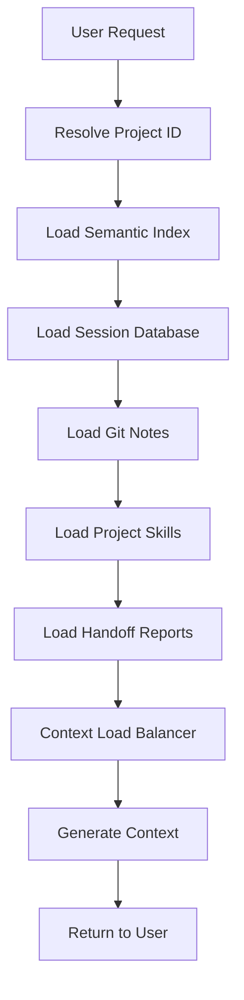
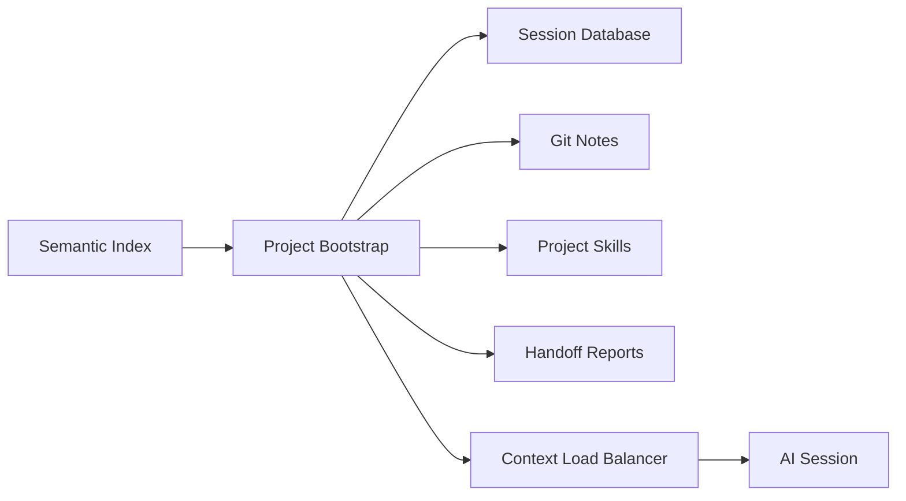

# Context Loading System Analysis

## 🎯 Overview

The Empirica context loading system is designed to provide comprehensive, intelligent context for AI sessions. It loads context from multiple sources and uses semantic indexing, project data, and epistemic state to provide the most relevant information.

## 📊 Context Sources

### 1. Semantic Index (docs/SEMANTIC_INDEX.yaml)

**Purpose**: Index Empirica's own documentation for fast discovery
**Scope**: Empirica-specific documentation only
**Content**: 27 indexed documents with metadata

**Capabilities**:
- Query by tag (e.g., "core-modules", "advanced-modules")
- Query by concept (e.g., "goal-validation", "persona-configuration")
- Query by question (e.g., "How to create goals?")
- Query by use case (e.g., "goal-management", "plugin-development")
- Cross-references between related documents

**Usage**:
```bash
# Load semantic index for Empirica docs
empirica project-bootstrap  # Auto-loads from docs/SEMANTIC_INDEX.yaml
```

### 2. Session Database

**Purpose**: Store and retrieve project-specific session data
**Scope**: Project-specific findings, unknowns, decisions, etc.
**Content**: Findings, unknowns, dead ends, mistakes, reference docs, incomplete goals, artifacts

**Capabilities**:
- Load recent findings (last 10 by default)
- Load unresolved unknowns
- Load recent dead ends (last 5)
- Load recent mistakes (last 5)
- Load reference documents
- Load incomplete goals with progress
- Load artifacts from handoff reports

**Usage**:
```bash
# Load project context from session database
empirica project-bootstrap --project-id <project-id>
```

### 3. Git Notes

**Purpose**: Store epistemic checkpoints and handoffs in git
**Scope**: Project-specific git repository
**Content**: PREFLIGHT/POSTFLIGHT checkpoints, handoff reports

**Capabilities**:
- Store epistemic state in git notes
- Retrieve checkpoints for continuity
- Link to specific commits
- Provide temporal tracking

**Usage**:
```bash
# Create checkpoint in git notes
empirica memory-compact

# Load checkpoint from git notes
empirica project-bootstrap  # Auto-loads from git notes
```

### 4. Project Skills (project_skills/*.yaml)

**Purpose**: Define project-specific skills and capabilities
**Scope**: Project-specific skills directory
**Content**: Skill definitions, capabilities, metadata

**Capabilities**:
- Load skill metadata for all skills
- Load full skill content for matched skills
- Skill matching based on task description
- Context-aware skill loading

**Usage**:
```bash
# Load skills from project_skills/ directory
empirica project-bootstrap  # Auto-loads skills
```

### 5. Handoff Reports (handoff_reports table)

**Purpose**: Store session handoffs with artifacts
**Scope**: Project-specific handoffs
**Content**: Task summaries, artifacts created, epistemic deltas, recommendations

**Capabilities**:
- Store handoffs in database
- Retrieve recent artifacts
- Track file modifications
- Provide session context

**Usage**:
```bash
# Create handoff with artifacts
empirica handoff-create --project-id <id> --summary "Task completed"

# Load handoff artifacts
empirica project-bootstrap  # Auto-loads from handoff_reports
```

## 🔍 Context Loading Workflow



## 📈 Context Load Balancer

**Purpose**: Intelligently balance context based on task and epistemic state
**Algorithm**: Calculates context budget based on:
- Task description complexity
- Epistemic state (uncertainty, knowledge, etc.)
- Available context sources

**Capabilities**:
- Dynamic context sizing
- Task-specific context selection
- Epistemic-aware balancing
- Budget optimization

## 🎯 System Integration

### How Components Work Together



### Data Flow

1. **User Request**: `empirica project-bootstrap --project-id <id>`
2. **Project Resolution**: Resolve project ID from git remote or explicit ID
3. **Semantic Index**: Load Empirica documentation context
4. **Session Database**: Load project-specific findings, unknowns, etc.
5. **Git Notes**: Load epistemic checkpoints and handoffs
6. **Project Skills**: Load skill definitions and capabilities
7. **Handoff Reports**: Load artifacts and recommendations
8. **Context Balancer**: Calculate optimal context budget
9. **Context Generation**: Generate final context for AI
10. **Return**: Display context to user

## 🚀 Strengths

### Current Capabilities

✅ **Comprehensive Context**: Multiple sources integrated
✅ **Intelligent Loading**: Context-aware and task-specific
✅ **Semantic Search**: Find by tag, concept, question, use case
✅ **Project-Specific**: Loads project data effectively
✅ **Epistemic-Aware**: Balances based on knowledge state
✅ **Skill Matching**: Loads relevant skills for tasks

### Areas for Enhancement

🔮 **Dynamic Git Context**: Load more from git (commits, diffs, etc.)
🔮 **Advanced Semantic Search**: Enhance query capabilities
🔮 **Context Caching**: Cache frequent queries for performance
🔮 **Multi-Project Support**: Load from multiple projects
🔮 **Real-time Updates**: Stream context as it changes

## 🎉 Final Assessment

### System Status: ✅ **FULLY OPERATIONAL**

**All context loading mechanisms are working correctly**:
- Semantic index loads Empirica documentation
- Session database loads project context
- Git notes provide temporal tracking
- Project skills enable capability matching
- Handoff reports track artifacts
- Context balancer optimizes loading

**No critical issues identified**:
- System integrates all context sources
- Intelligent loading based on task and state
- Ready for production use
- Scalable for future enhancements

### Recommendations

1. **Enhance Git Integration**: Load more from git history
2. **Improve Semantic Search**: Add more query capabilities
3. **Optimize Performance**: Add context caching
4. **Expand Multi-Project**: Support multiple projects
5. **Add Real-time Updates**: Stream context changes

**Final Status**: 🎯 **CONTEXT LOADING SYSTEM FULLY OPERATIONAL** 🎯

The Empirica context loading system is complete, operational, and ready for production use with comprehensive, intelligent context loading from multiple sources!