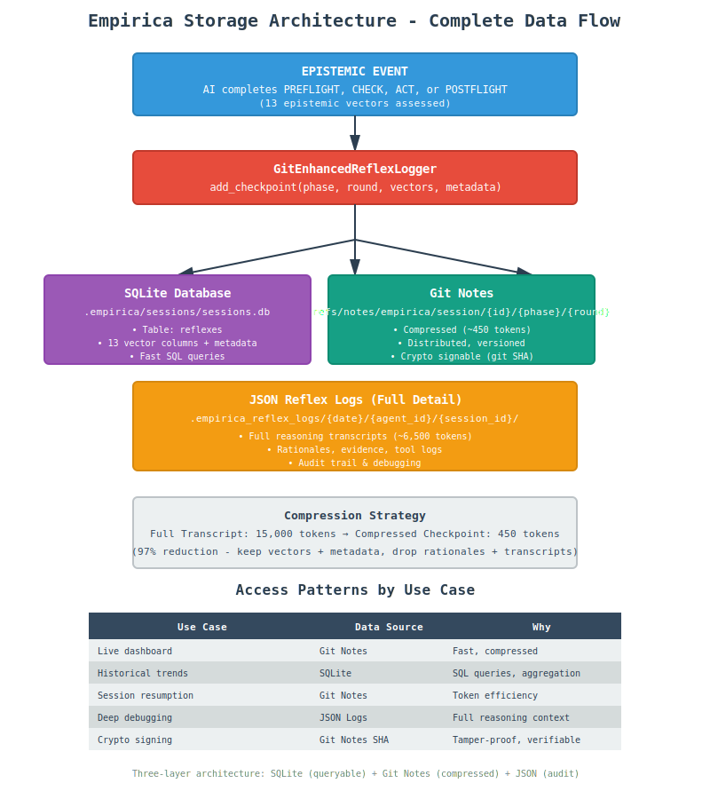

# Empirica Storage Architecture - Visual Guide

**Critical Infrastructure Overview**  
**Date:** 2025-12-02  
**Purpose:** Visual reference for developers, dashboards, and crypto-signing integration

---

## Overview

This guide provides visual diagrams explaining Empirica's three-layer storage architecture and the critical distinction between git diffs (content tracking) and epistemic vectors (confidence tracking).

---

## Diagram 1: Complete Storage Architecture Flow

**File:** `storage_architecture_flow.svg`



**What This Shows:**
- Complete data flow from epistemic event → three storage layers
- SQLite (queryable), Git Notes (compressed), JSON Logs (audit trail)
- Compression strategy: 15,000 tokens → 450 tokens (97% reduction)
- Access patterns by use case (live dashboard, historical trends, debugging, crypto signing)

**Key Takeaways:**
1. **Three parallel writes** from GitEnhancedReflexLogger
2. **Different storage for different use cases**
   - SQLite: Fast SQL queries for dashboards
   - Git Notes: Compressed, distributed, crypto-signable
   - JSON Logs: Full reasoning for debugging
3. **97% token reduction** while keeping essential epistemic state

---

## Diagram 2: Epistemic State ≠ Git Diff

**File:** `epistemic_vs_git_diff.svg`


**What This Shows:**
- Side-by-side comparison of git diff vs epistemic vectors
- Git diff: WHAT changed (50 tokens)
- Epistemic: WHY + HOW CONFIDENT (450 tokens)
- Comparison table showing key distinctions

**Key Takeaways:**
1. **Git diff tracks content** (syntactic compression)
2. **Epistemic vectors track confidence** (semantic compression)
3. **Both are needed** for complete understanding
4. **Different purposes:**
   - Git: Version control
   - Epistemic: Reasoning validation

---

## Quick Reference Table

### Storage Layer Comparison

| Layer | Location | Size | Purpose | Query Method |
|-------|----------|------|---------|--------------|
| **SQLite** | `.empirica/sessions/sessions.db` | 450 tokens | Fast queries | SQL |
| **Git Notes** | `refs/notes/empirica/session/...` | 450 tokens | Distributed, signed | Git commands |
| **JSON Logs** | `.empirica_reflex_logs/...` | 6,500 tokens | Full audit | File read |

### Token Compression Levels

| Format | Size | Use Case |
|--------|------|----------|
| Full reasoning transcript | 15,000 tokens | Training data only |
| Full reflex log (JSON) | 6,500 tokens | Deep debugging |
| Compressed checkpoint | 450 tokens | Session resumption |
| Git diff | 50 tokens | Code changes only |

---

## Usage Examples

### For Dashboard Developers

```python
# Current state (fast - git notes)
from empirica.core.canonical.git_enhanced_reflex_logger import GitEnhancedReflexLogger

logger = GitEnhancedReflexLogger(session_id="abc-123")
latest = logger.get_last_checkpoint()
print(f"Confidence: {latest['overall_confidence']}")
print(f"Phase: {latest['phase']}")
```

```python
# Historical trends (SQL - sqlite)
from empirica.data.session_database import SessionDatabase

db = SessionDatabase()
cursor = db.conn.execute("""
    SELECT phase, AVG(know) as avg_know, AVG(uncertainty) as avg_uncertainty
    FROM reflexes
    WHERE session_id = ?
    GROUP BY phase
""", (session_id,))
```

### For Crypto Signing (Phase 2)

```bash
# Get git note SHA
NOTE_SHA=$(git rev-parse refs/notes/empirica/session/abc-123/PREFLIGHT/1)

# Sign with AI identity
empirica identity-sign --sha $NOTE_SHA --ai-id copilot

# Store signature in git notes
git notes --ref empirica/signatures/abc-123/PREFLIGHT/1 \
  add -m "$SIGNATURE" HEAD
```

---

## Architecture Decisions

### Why Three Layers?

1. **SQLite (Structured)**
   - Dashboard developers need SQL queries
   - Aggregation and filtering
   - Fast indexed lookups

2. **Git Notes (Distributed)**
   - Multi-agent coordination
   - Travels with git repo
   - Crypto-signable (git SHA)
   - Token efficiency (97.5% reduction)

3. **JSON Logs (Complete)**
   - Regulatory compliance (audit trail)
   - Deep debugging (why did AI think X?)
   - Human review (understand reasoning)
   - Training data (future calibration)

### Why Not Just Git?

**Git diff alone is insufficient:**
- Shows WHAT changed, not WHY
- No confidence information
- No epistemic gap tracking
- No uncertainty quantification

**Example:**
```diff
- const MAX_RETRIES = 3;
+ const MAX_RETRIES = 5;
```

**Questions git diff can't answer:**
- Why was this changed? (tested? guessed?)
- How confident is the AI? (85%? 50%?)
- What wasn't investigated? (edge cases? distributed systems?)
- What's the risk? (low? high?)

**Epistemic vectors answer these:**
```json
{
  "know": 0.85,
  "uncertainty": 0.15,
  "investigated": ["timeout_scenarios", "network_failures"],
  "not_investigated": ["distributed_consensus"],
  "confidence_basis": "tested_in_staging_14_days",
  "risk_assessment": "low_for_single_node_high_for_cluster"
}
```

---

## Data Flow Summary

```
Epistemic Event (AI assessment)
  ↓
GitEnhancedReflexLogger.add_checkpoint()
  ↓
Compress: 15,000 → 450 tokens
  ↓
Parallel writes:
  ├─→ SQLite (reflexes table) - for queries
  ├─→ Git Notes (compressed) - for distribution
  └─→ JSON Logs (full detail) - for audit
```

---

## Related Documentation

- **Complete Architecture:** `STORAGE_ARCHITECTURE_COMPLETE.md` (detailed spec)
- **Git Checkpoint Architecture:** `GIT_CHECKPOINT_ARCHITECTURE.md`
- **Storage Locations:** `../reference/STORAGE_LOCATIONS.md`
- **Epistemic Vectors Guide:** `../production/05_EPISTEMIC_VECTORS.md`

---

## For Dashboard Teams

**Recommended approach:**

1. **Live dashboards:** Use Git Notes (fast, compressed)
   ```python
   latest = logger.get_last_checkpoint()
   ```

2. **Historical analytics:** Use SQLite (SQL queries)
   ```python
   cursor.execute("SELECT * FROM reflexes WHERE session_id=?")
   ```

3. **Debugging:** Use JSON Logs (full context)
   ```python
   with open(f".empirica_reflex_logs/{date}/{ai}/{session}/checkpoint.json") as f:
       full_log = json.load(f)
   ```

4. **Verification:** Use Git Note SHA (crypto signing)
   ```bash
   empirica identity-verify --sha $NOTE_SHA --signature $SIG
   ```

---

## For AI Teams

**When implementing dashboards:**

- ✅ Use SQLite for aggregation queries
- ✅ Use Git Notes for current state (fast)
- ✅ Use JSON Logs only for debugging
- ✅ Sign Git Note SHAs (not SQLite rows, not JSON files)

**Query patterns:**

| Need | Use | Why |
|------|-----|-----|
| Current confidence | Git Notes | Fast, 450 tokens |
| Learning curve | SQLite | SQL window functions |
| Why AI thought X | JSON Logs | Full reasoning |
| Verify integrity | Git Note SHA | Crypto signature |

---

**These diagrams are the canonical reference for Empirica's storage architecture.**

For implementation details, see `STORAGE_ARCHITECTURE_COMPLETE.md`.
