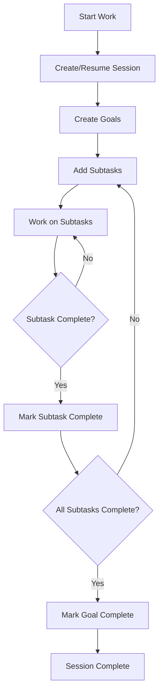

# Empirica Session and Goal Workflow Guide

This guide explains Empirica's session-based goal management system and provides practical workflow examples.

## Understanding the Architecture

### Key Concepts

1. **Sessions**: Work containers that track AI activity, goals, and progress
2. **Goals**: Objectives with success criteria and completion tracking
3. **Subtasks**: Smaller tasks that contribute to goal completion
4. **Scope Vectors**: Define goal characteristics (breadth, duration, coordination)

### Why Sessions Matter

Empirica uses sessions to:
- **Maintain context** across multiple interactions
- **Track progress** on long-running objectives
- **Provide continuity** when switching between tasks
- **Enable collaboration** between multiple AIs

## Basic Workflow

### 1. Create or Resume a Session

```bash
# Create a new session
empirica session-create --ai-id claude-copilot --subject "documentation"

# Resume an existing session
empirica sessions-list  # Find your session ID
empirica sessions-resume --session-id 81a9dfd3
```

**Tip**: Use `empirica project-bootstrap` to get session context automatically.

### 2. Create Goals

```bash
# Create a goal with JSON config
cat > my_goal.json << 'EOF'
{
    "session_id": "81a9dfd3",
    "objective": "Complete documentation for core modules",
    "scope": {
        "breadth": 0.8,
        "duration": 0.7,
        "coordination": 0.3
    },
    "estimated_complexity": 0.6,
    "success_criteria": [
        {
            "description": "Document goals module",
            "threshold": 1.0
        },
        {
            "description": "Document persona module",
            "threshold": 1.0
        }
    ]
}
EOF

empirica goals-create my_goal.json
```

### 3. Add Subtasks

```bash
# Add subtasks to your goal
goal_id="ac48c59b-76de-47db-943c-3f557d270435"

empirica goals-add-subtask --goal-id $goal_id \
    --description "Document goals validation module" \
    --importance high

empirica goals-add-subtask --goal-id $goal_id \
    --description "Document goals repository module" \
    --importance high
```

### 4. Work on Subtasks

```bash
# List your goals to see progress
empirica goals-list --session-id 81a9dfd3

# Check specific goal progress
empirica goals-progress --goal-id $goal_id

# Mark subtasks as complete when done
empirica goals-complete-subtask --task-id subtask-id-123 \
    --evidence "docs/reference/GOALS_VALIDATION.md"
```

### 5. Complete Goals

```bash
# When all subtasks are complete, mark goal as complete
empirica goals-complete --goal-id $goal_id
```

## Advanced Workflow Patterns

### Multi-Session Collaboration

```bash
# AI 1 creates session and initial goals
ai1_session="81a9dfd3"
empirica goals-create --session-id $ai1_session --objective "Research topic"

# AI 2 continues the work in same session
ai2_session="81a9dfd3"  # Same session ID
empirica goals-add-subtask --goal-id goal-id --description "Write report"

# Check combined progress
empirica goals-progress --goal-id goal-id
```

### Goal Discovery

```bash
# Discover goals from other sessions
empirica goals-discover --from-ai-id claude-research

# Claim a discovered goal for your session
empirica goals-claim --goal-id discovered-goal-id --session-id your-session-id
```

### Session Handoff

```bash
# Create handoff when switching AIs
empirica handoff-create --session-id 81a9dfd3 \
    --to-ai claude-research \
    --context "Please continue documentation work"

# Query handoffs to see pending work
empirica handoff-query --session-id 81a9dfd3
```

## Common Pitfalls and Solutions

### ❌ Problem: "Session ID required" Error

**Cause**: Trying to use goal commands without specifying a session.

**Solution**:
```bash
# Always specify session ID
actual_session=$(empirica sessions-list --limit 1 | grep -oP '⏳ \K[^ ]+')
empirica goals-list --session-id $actual_session
```

### ❌ Problem: "No PREFLIGHT checkpoint found"

**Cause**: Starting work without creating a baseline assessment.

**Solution**:
```bash
# Always start with PREFLIGHT
empirica preflight
# Then begin your work...
```

### ❌ Problem: Goals Not Showing Up

**Cause**: Goals are session-specific and you're checking the wrong session.

**Solution**:
```bash
# Check all sessions first
empirica sessions-list

# Then check goals for the correct session
empirica goals-list --session-id correct-session-id
```

## Best Practices

### Session Management

1. **One session per workstream**: Keep related work in one session
2. **Meaningful session names**: Use `--subject` to describe the work
3. **Regular checkpoints**: Use `empirica memory-compact` for long sessions
4. **Clean up completed sessions**: Archive finished work

### Goal Design

1. **SMART goals**: Specific, Measurable, Achievable, Relevant, Time-bound
2. **Appropriate scope**: Use scope vectors accurately
3. **Clear success criteria**: Make completion objective
4. **Manageable subtasks**: Break goals into 3-7 subtasks

### Workflow Efficiency

```bash
# Use project-bootstrap for context
empirica project-bootstrap

# Check ready work before starting
empirica goals-ready --session-id your-session-id

# Use tab completion for commands
empirica <TAB><TAB>

# Get help when needed
empirica goals-list --help
```

## Integration with BEADS (Optional)

```bash
# Create goals with BEADS integration
empirica goals-create goal_config.json --use-beads

# BEADS goals show up in goals-ready
empirica goals-ready --session-id your-session-id

# Complete BEADS-linked goals
empirica goals-complete --goal-id beads-goal-id --use-beads
```

## Visual Workflow



## Troubleshooting

### Check Session Status

```bash
empirica sessions-show --session-id 81a9dfd3
```

### Verify Goal Existence

```bash
empirica goals-list --session-id 81a9dfd3
```

### Debug Command Issues

```bash
# Use verbose mode
empirica goals-list --session-id 81a9dfd3 --verbose

# Check logs
empirica monitor --type error
```

## Example: Complete Documentation Workflow

```bash
# 1. Start session
session_id=$(empirica session-create --ai-id claude-copilot --subject "documentation" | grep -oP '"session_id": "\K[^"]+')

# 2. Create documentation goal
cat > doc_goal.json << 'EOF'
{
    "session_id": "'$session_id'",
    "objective": "Document core Empirica modules",
    "scope": {"breadth": 0.8, "duration": 0.7, "coordination": 0.2},
    "estimated_complexity": 0.6
}
EOF

goal_id=$(empirica goals-create doc_goal.json | grep -oP '"goal_id": "\K[^"]+')

# 3. Add documentation subtasks
empirica goals-add-subtask --goal-id $goal_id --description "Document goals module" --importance high
task1=$(empirica goals-get-subtasks --goal-id $goal_id | grep -oP 'Task ID: \K[^-]+')

empirica goals-add-subtask --goal-id $goal_id --description "Document persona module" --importance high
task2=$(empirica goals-get-subtasks --goal-id $goal_id | grep -oP 'Task ID: \K[^-]+' | tail -1)

# 4. Work on subtasks
# ... do documentation work ...

# 5. Mark subtasks complete
empirica goals-complete-subtask --task-id $task1 --evidence "docs/reference/GOALS_MODULE.md"
empirica goals-complete-subtask --task-id $task2 --evidence "docs/reference/PERSONA_MODULE.md"

# 6. Complete goal
empirica goals-complete --goal-id $goal_id

# 7. Check progress
empirica goals-progress --goal-id $goal_id
```

## Summary

Empirica's session and goal system provides:

✅ **Context continuity** across multiple interactions
✅ **Progress tracking** for complex objectives
✅ **Collaboration support** between multiple AIs
✅ **Structured workflow** for systematic work
✅ **Integration** with BEADS and other systems

**Remember**: Always work within a session, create clear goals, and track progress systematically!