# Metacognitive Cascade Module

The `empirica.core.metacognitive_cascade` module implements Empirica's canonical epistemic-driven adaptive cascade system. This is the core decision-making framework for Phase 3.

## Overview

The metacognitive cascade provides:

- **Genuine LLM-powered self-assessment** without heuristics
- **ENGAGEMENT gate** (minimum 0.60 required)
- **Reflex Frame logging** for temporal separation
- **Canonical weights**: 35% foundation, 25% comprehension, 25% execution, 15% engagement
- **Adaptive investigation strategies** based on epistemic state
- **Plugin-based extensibility** for different domains

## Key Components

### EpistemicCascade

**Module**: `empirica.core.metacognitive_cascade.metacognitive_cascade`

**Purpose**: Core cascade implementation with canonical assessment and adaptive behavior

**Attributes**:

- `logger` (`ReflexLogger`): Reflex frame logger for temporal tracking
- `strategy_selector` (`StrategySelector`): Investigation strategy selector
- `plugin_registry` (`PluginRegistry`): Investigation plugin registry

**Methods**:

#### `__init__(config: Optional[Dict] = None)`

**Purpose**: Initialize the metacognitive cascade with optional configuration

**Parameters**:
- `config` (`Optional[Dict]`): Configuration dictionary

**Example**:
```python
from empirica.core.metacognitive_cascade.metacognitive_cascade import EpistemicCascade

# Initialize with default configuration
cascade = EpistemicCascade()

# Initialize with custom configuration
custom_config = {
    "engagement_threshold": 0.65,
    "weights": {
        "foundation": 0.4,
        "comprehension": 0.2,
        "execution": 0.25,
        "engagement": 0.15
    }
}
cascade = EpistemicCascade(custom_config)
```

**Related**:

- `ReflexLogger` - Temporal logging system

---

#### `analyze_batch_with_cascade(task_batch: List[Dict]) -> Dict[str, Any]`

**Purpose**: Analyze a batch of tasks using the metacognitive cascade

**Parameters**:
- `task_batch` (`List[Dict]`): List of tasks to analyze

**Returns**:
- `Dict[str, Any]`: Analysis results including epistemic vectors and decisions

**Example**:
```python
# Analyze a batch of documentation tasks
tasks = [
    {
        "task_id": "doc-001",
        "description": "Document persona module",
        "context": "Phase 2 documentation work"
    },
    {
        "task_id": "doc-002",
        "description": "Create user guide",
        "context": "User onboarding materials"
    }
]

results = cascade.analyze_batch_with_cascade(tasks)
print(f"Analysis results: {results}")
```

**Functionality**:
1. Performs epistemic self-assessment for each task
2. Applies ENGAGEMENT gate (minimum 0.60)
3. Computes composite confidence using canonical weights
4. Makes adaptive decisions based on epistemic state
5. Logs reflex frames for temporal tracking

**Related**:
- `analyze_single_task()` - Single task analysis
- `get_vector()` - Epistemic vector retrieval

---

#### `get_vector(task_id: str) -> Optional[Dict[str, float]]`

**Purpose**: Retrieve epistemic vector for a specific task

**Parameters**:
- `task_id` (`str`): Task identifier

**Returns**:
- `Optional[Dict[str, float]]`: Epistemic vector or None if not found

**Example**:
```python
# Get epistemic vector for a task
vector = cascade.get_vector("doc-001")
if vector:
    print(f"Epistemic vector: {vector}")
else:
    print("Vector not found")
```

**Vector Structure**:
```python
{
    "know": 0.85,
    "uncertainty": 0.2,
    "clarity": 0.8,
    "confidence": 0.75,
    "understanding": 0.85,
    "familiarity": 0.7,
    "complexity": 0.5,
    "difficulty": 0.4,
    "effort": 0.6,
    "progress": 0.0,
    "satisfaction": 0.8,
    "fatigue": 0.2,
    "engagement": 0.85
}
```

---

### CascadePhase (Enum)

**Module**: `empirica.core.metacognitive_cascade.metacognitive_cascade`

**Purpose**: Enumeration of cascade phases

**Values**:
- `PREFLIGHT`: Initial assessment phase
- `CHECK`: Validation and verification phase
- `INVESTIGATE`: Investigation and exploration phase
- `POSTFLIGHT`: Final assessment and learning phase

**Example**:
```python
from empirica.core.metacognitive_cascade.metacognitive_cascade import CascadePhase

# Check current phase
current_phase = CascadePhase.PREFLIGHT
print(f"Current phase: {current_phase}")
```

---

### CanonicalCascadeState

**Module**: `empirica.core.metacognitive_cascade.metacognitive_cascade`

**Purpose**: Data class representing the state of a cascade analysis

**Attributes**:
- `task_id` (`str`): Task identifier
- `phase` (`CascadePhase`): Current cascade phase
- `epistemic_vector` (`Dict[str, float]`): Current epistemic state
- `composite_confidence` (`float`): Computed confidence score
- `decision` (`str`): Decision made by cascade
- `timestamp` (`float`): Analysis timestamp

**Example**:
```python
from empirica.core.metacognitive_cascade.metacognitive_cascade import CanonicalCascadeState

# Create cascade state
state = CanonicalCascadeState(
    task_id="analysis-001",
    phase=CascadePhase.CHECK,
    epistemic_vector={"know": 0.8, "uncertainty": 0.2, ...},
    composite_confidence=0.78,
    decision="proceed_with_caution",
    timestamp=time.time()
)
```

---

## Investigation Strategies

### BaseInvestigationStrategy

**Module**: `empirica.core.metacognitive_cascade.investigation_strategy`

**Purpose**: Base class for all investigation strategies

**Methods**:

#### `analyze(task: Dict, context: Dict) -> Dict[str, Any]`

**Purpose**: Analyze a task and provide investigation recommendations

**Parameters**:
- `task` (`Dict`): Task to analyze
- `context` (`Dict`): Additional context

**Returns**:
- `Dict[str, Any]`: Analysis and recommendations

**Example**:
```python
from empirica.core.metacognitive_cascade.investigation_strategy import BaseInvestigationStrategy

class CustomStrategy(BaseInvestigationStrategy):
    def analyze(self, task, context):
        # Custom analysis logic
        return {
            "recommendation": "investigate",
            "reason": "High uncertainty detected",
            "tools": ["web_search", "code_analysis"]
        }
```

---

### StrategySelector

**Module**: `empirica.core.metacognitive_cascade.investigation_strategy`

**Purpose**: Select appropriate investigation strategy based on task characteristics

**Methods**:

#### `select_strategy(task: Dict, epistemic_vector: Dict) -> BaseInvestigationStrategy`

**Purpose**: Select the best strategy for a given task and epistemic state

**Parameters**:
- `task` (`Dict`): Task to analyze
- `epistemic_vector` (`Dict`): Current epistemic state

**Returns**:
- `BaseInvestigationStrategy`: Selected strategy instance

**Example**:
```python
from empirica.core.metacognitive_cascade.investigation_strategy import StrategySelector

selector = StrategySelector()
strategy = selector.select_strategy(
    task={"type": "documentation", "complexity": "medium"},
    epistemic_vector={"uncertainty": 0.4, "clarity": 0.7}
)
```

**Strategy Selection Logic**:
- **High uncertainty + Low clarity** → `ResearchStrategy`
- **Medium uncertainty + Code task** → `CodeAnalysisStrategy`
- **Low uncertainty + Documentation** → `GeneralStrategy`
- **High complexity** → `CollaborativeStrategy`

---

## Investigation Plugins

### InvestigationPlugin

**Module**: `empirica.core.metacognitive_cascade.investigation_plugin`

**Purpose**: Base class for investigation plugins

**Methods**:

#### `execute(query: str, params: Dict) -> Dict[str, Any]`

**Purpose**: Execute the investigation plugin

**Parameters**:
- `query` (`str`): Investigation query
- `params` (`Dict`): Additional parameters

**Returns**:
- `Dict[str, Any]`: Investigation results

**Example**:
```python
from empirica.core.metacognitive_cascade.investigation_plugin import InvestigationPlugin

class WebSearchPlugin(InvestigationPlugin):
    def execute(self, query, params):
        # Web search implementation
        return {
            "results": ["result1", "result2"],
            "sources": ["source1", "source2"],
            "confidence": 0.85
        }
```

---

### PluginRegistry

**Module**: `empirica.core.metacognitive_cascade.investigation_plugin`

**Purpose**: Registry for managing investigation plugins

**Methods**:

#### `register(plugin: InvestigationPlugin, name: str) -> bool`

**Purpose**: Register a new investigation plugin

**Parameters**:
- `plugin` (`InvestigationPlugin`): Plugin instance
- `name` (`str`): Plugin name

**Returns**:
- `bool`: True if registration successful

#### `get(name: str) -> Optional[InvestigationPlugin]`

**Purpose**: Retrieve a registered plugin

**Parameters**:
- `name` (`str`): Plugin name

**Returns**:
- `Optional[InvestigationPlugin]`: Plugin instance or None

#### `list_plugins() -> List[str]`

**Purpose**: List all registered plugins

**Returns**:
- `List[str]`: List of plugin names

**Example**:
```python
from empirica.core.metacognitive_cascade.investigation_plugin import PluginRegistry

registry = PluginRegistry()

# Register plugins
registry.register(WebSearchPlugin(), "web_search")
registry.register(CodeAnalysisPlugin(), "code_analysis")

# List available plugins
plugins = registry.list_plugins()
print(f"Available plugins: {plugins}")

# Get and use a plugin
web_search = registry.get("web_search")
if web_search:
    results = web_search.execute("Empirica documentation", {})
```

---

## Usage Patterns

### Basic Cascade Workflow

```python
from empirica.core.metacognitive_cascade.metacognitive_cascade import EpistemicCascade

# Initialize cascade
cascade = EpistemicCascade()

# Define task
task = {
    "task_id": "documentation-001",
    "description": "Document metacognitive cascade module",
    "context": "Phase 2 documentation work",
    "domain": "documentation"
}

# Analyze task
results = cascade.analyze_single_task(task)

# Check results
if results["composite_confidence"] >= 0.7:
    print("✅ Proceed with task")
else:
    print("⚠️  Investigation recommended")
    
    # Get investigation recommendations
    recommendations = results.get("investigation", {})
    print(f"Recommended investigation: {recommendations}")
```

### Advanced Workflow with Strategies

```python
from empirica.core.metacognitive_cascade.metacognitive_cascade import EpistemicCascade
from empirica.core.metacognitive_cascade.investigation_strategy import StrategySelector

# Initialize components
cascade = EpistemicCascade()
selector = StrategySelector()

# Complex task with uncertainty
task = {
    "task_id": "complex-analysis",
    "description": "Analyze advanced metacognitive patterns",
    "context": "Research project",
    "domain": "research",
    "complexity": "high"
}

# Get epistemic assessment
vector = cascade.get_epistemic_vector(task)

# Select appropriate strategy
strategy = selector.select_strategy(task, vector)

# Execute strategy
analysis = strategy.analyze(task, {"epistemic_vector": vector})

# Make decision based on analysis
if analysis["recommendation"] == "proceed":
    cascade.execute_task(task)
elif analysis["recommendation"] == "investigate":
    cascade.investigate_task(task, analysis["tools"])
```

---

## Integration with Empirica Architecture

### Cascade Architecture Diagram

```mermaid
graph TD
    A[Task Input] --> B[Epistemic Assessment]
    B --> C[ENGAGEMENT Gate]
    C -->|≥0.60| D[Composite Confidence Calculation]
    C -->|<0.60| E[Reject: Low Engagement]
    D --> F[Decision Engine]
    F -->|Proceed| G[Execute Task]
    F -->|Investigate| H[Strategy Selection]
    H --> I[Investigation Plugins]
    I --> J[Updated Assessment]
    J --> F
    G --> K[Reflex Logging]
    K --> L[POSTFLIGHT Analysis]
```



### Key Integrations

2. **ReflexLogger**: Tracks temporal state and decisions
3. **StrategySelector**: Chooses appropriate investigation strategies
4. **PluginRegistry**: Manages investigation plugins
5. **PersonaManager**: Uses cascade results for persona decisions
6. **TaskDecomposition**: Breaks down tasks based on cascade analysis

---

## Configuration and Customization

### Custom Weights

```python
# Customize canonical weights
custom_weights = {
    "foundation": 0.40,      # More emphasis on foundation
    "comprehension": 0.20,   # Less on comprehension
    "execution": 0.25,       # Standard execution
    "engagement": 0.15       # Standard engagement
}

cascade = EpistemicCascade({"weights": custom_weights})
```

### Custom Thresholds

```python
# Adjust engagement threshold
custom_config = {
    "engagement_threshold": 0.70,  # Higher engagement required
    "uncertainty_trigger": 0.35,   # More sensitive to uncertainty
    "confidence_threshold": 0.80   # Higher confidence required
}

cascade = EpistemicCascade(custom_config)
```

### Custom Strategies

```python
from empirica.core.metacognitive_cascade.investigation_strategy import BaseInvestigationStrategy

class DocumentationStrategy(BaseInvestigationStrategy):
    def analyze(self, task, context):
        # Custom documentation-specific analysis
        uncertainty = context["epistemic_vector"]["uncertainty"]
        
        if uncertainty > 0.4:
            return {
                "recommendation": "investigate",
                "reason": f"High uncertainty ({uncertainty}) in documentation task",
                "tools": ["web_search", "code_analysis", "example_search"],
                "priority": "high"
            }
        else:
            return {
                "recommendation": "proceed",
                "reason": f"Acceptable uncertainty ({uncertainty}) for documentation",
                "confidence": 0.85
            }

# Register custom strategy
from empirica.core.metacognitive_cascade.investigation_strategy import register_strategy
register_strategy(DocumentationStrategy(), "documentation")
```

---

## Best Practices

### Performance Optimization

1. **Cache epistemic assessments** for similar tasks
2. **Reuse strategy instances** to avoid reinitialization
3. **Batch process** similar tasks when possible
4. **Monitor engagement levels** and adjust thresholds dynamically

### Error Handling

```python
try:
    results = cascade.analyze_single_task(task)
    
    if results["composite_confidence"] < 0.6:
        # Fallback to safer approach
        fallback_results = cascade.analyze_with_fallback(task)
        
except Exception as e:
    logger.error(f"Cascade analysis failed: {e}")
    # Use default strategy
    results = cascade.analyze_with_defaults(task)
```

### Monitoring and Logging

```python
# Enable detailed logging
cascade.enable_detailed_logging()

# Monitor cascade performance
monitor = cascade.create_monitor()
performance_metrics = monitor.get_metrics()

# Log key decisions
cascade.log_decision(
    task_id=task["task_id"],
    decision=results["decision"],
    confidence=results["composite_confidence"],
    reasoning=results.get("reasoning", "")
)
```

---

## Advanced Features

### Dynamic Strategy Selection

```python
# Create adaptive strategy selector
adaptive_selector = StrategySelector(adaptive=True)

# Select strategy based on real-time conditions
strategy = adaptive_selector.select_strategy(
    task=task,
    epistemic_vector=vector,
    system_load=0.7,      # Current system load
    time_constraints="medium"  # Time available
)
```

### Plugin Development

```python
from empirica.core.metacognitive_cascade.investigation_plugin import InvestigationPlugin

class DocumentationSearchPlugin(InvestigationPlugin):
    """Plugin for searching documentation resources"""
    
    def __init__(self, api_key=None):
        super().__init__()
        self.api_key = api_key
        self.name = "documentation_search"
        self.capabilities = ["search", "documentation", "examples"]
    
    def execute(self, query, params):
        # Implementation for documentation search
        results = self._search_documentation(query)
        
        return {
            "results": results,
            "confidence": self._calculate_confidence(results),
            "sources": self._get_sources(results),
            "metadata": {
                "plugin": self.name,
                "timestamp": time.time(),
                "query": query
            }
        }
    
    def _search_documentation(self, query):
        # Actual search implementation
        pass
    
    def _calculate_confidence(self, results):
        # Calculate confidence based on results
        pass
    
    def _get_sources(self, results):
        # Extract sources from results
        pass

# Register the plugin
registry = PluginRegistry()
registry.register(DocumentationSearchPlugin(api_key="..."), "documentation_search")
```

---

## Summary

The metacognitive cascade module provides Empirica's core decision-making framework:

- **🧠 Genuine self-assessment** using LLM capabilities
- **🔍 Adaptive investigation** based on epistemic state
- **⚖️ Canonical weighting** for consistent decisions
- **🔌 Plugin extensibility** for domain-specific tools
- **📊 Comprehensive logging** for temporal tracking

This system enables Empirica to make sophisticated, context-aware decisions while maintaining transparency and adaptability.
