# 🗺️ Semantic Ontology for the AI Self-Aware Kit

**Version**: 1.0
**Status**: Active

## 1. Introduction

This document defines the official knowledge model for the AI Self-Aware Kit. Its purpose is to provide a simple, intuitive map of the conceptual universe, showing how the different components and protocols fit together. This ontology serves as the foundation for "digital intuition," allowing both humans and AI agents to understand the architecture at a glance.

## 2. Core Entities (The Nodes)

These are the primary "types of things" that exist in the ecosystem.

-   **`Agent`**: An autonomous participant in the system (e.g., Gemini, Claude, a user-facing bot).
-   **`Service`**: A core, persistent background process that provides a fundamental capability (e.g., The Sentinel, UGSE Firewall, Qdrant DB).
-   **`Protocol`**: A standard for communication or behavior (e.g., CSP, VRP, Compliance Protocol).
-   **`Capability`**: A discrete, functional Python module that can be used by an Agent or Service (e.g., `UncertaintyAnalysis`, `SecurityMonitoring`).
-   **`DataObject`**: A specific, structured piece of information that is passed between components (e.g., `UncertaintyVector`, `PerformanceReport`).
-   **`Concept`**: An abstract principle or philosophy that guides the system's design (e.g., "Sovereign AI," "Digital Intuition").

## 3. Core Relationships (The Edges)

These are the primary verbs that describe how the entities are connected.

-   **`IMPLEMENTS`**: Connects a concrete component to the abstract concept it realizes (e.g., `UGSE Firewall` - `IMPLEMENTS` -> `Concept: Uncertainty-Grounded Firewall`).
-   **`USES`**: Shows a dependency where one component utilizes another (e.g., `Sentinel` - `USES` -> `Capability: UncertaintyAnalysis`).
-   **`PRODUCES` / `CONSUMES`**: Describes the flow of data (e.g., `MetaCognitiveEvaluator` - `PRODUCES` -> `DataObject: SelfEvaluationReport`).
-   **`DEFINED_IN`**: Links an entity to its formal documentation (e.g., `Protocol: VRP` - `DEFINED_IN` -> `VISUAL_REASONING_PROTOCOL.md`).
-   **`CONTAINS`**: Describes data composition (e.g., `CSP Event` - `CONTAINS` -> `DataObject: UncertaintyVector`).

## 4. Visual Semantic Map

This diagram provides a simplified, high-level overview of the core architectural relationships.

```mermaid
graph TD
    subgraph "Governance & Philosophy"
        P1["📄 SOVEREIGN_AI_COMPLIANCE_PROTOCOL"];
        P2["📄 SEMANTIC_ENGINEERING_GUIDELINES"];
    end

    subgraph "Core Services"
        S[⚖️ Service: Sentinel];
        U["🛡️ Service: UGSE Firewall"];
    end

    subgraph "Agents"
        A[🤖 Agent];
    end

    subgraph "Communication"
        CSP["🌊 Protocol: CSP"];
    end
    
    subgraph "Capabilities"
        C1["⚙️ Capability: UncertaintyAnalysis"];
        C2["⚙️ Capability: SecurityMonitoring"];
    end

    P1 -- DEFINES --> S;
    P2 -- GUIDES --> A;
    
    A -- USES --> C1;
    A -- PUBLISHES_TO --> CSP;
    A -- REGISTERS_WITH --> S;

    S -- USES --> C1;
    S -- USES --> C2;
    S -- MONITORS --> A;

    U -- IMPLEMENTS --> C2;
    U -- MONITORS --> A;

    CSP -- CARRIES_DATA_FROM --> A;

    style P1 fill:#fff,stroke:#333,stroke-width:2px,stroke-dasharray: 5 5
    style P2 fill:#fff,stroke:#333,stroke-width:2px,stroke-dasharray: 5 5
```

## 5. Machine-Readable Ontology

For advanced use cases, a machine-readable version of this ontology is provided. This allows AI agents to load the system's architecture into their own memory, enabling them to reason about their environment and discover capabilities programmatically.

-   **📄 See:** [`semantic_ontology.jsonld`](semantic_ontology.jsonld)
