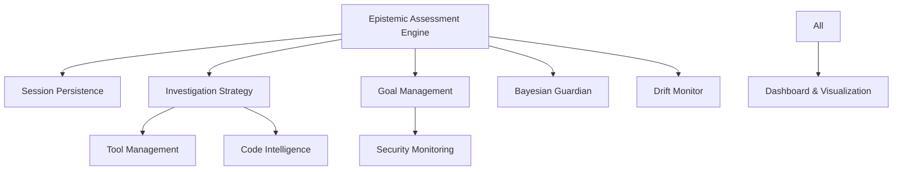

# Enterprise Components

**Modular Architecture for Scalable AI Systems**

[← Back to Platform](architecture.md) | [Features Overview](features.md) | [Architecture](architecture.md)

---

## Overview

Empirica is built on a modular architecture comprising **11 Enterprise Components**. These components work together to provide a robust, scalable, and secure foundation for metacognitive AI. While the core framework is lightweight, these components add enterprise-grade capabilities.

---

## The 11 Components

### 1. Code Intelligence Analyzer
**Purpose:** Deep semantic understanding of codebases.
- **Capabilities:** AST parsing, dependency mapping, complexity analysis.
- **Use Case:** Used during the INVESTIGATE phase to understand code context.

### 2. Context Validation Engine
**Purpose:** Ensures the AI has sufficient context before acting.
- **Capabilities:** Missing file detection, environment verification.
- **Use Case:** Runs during PREFLIGHT to check `CONTEXT` vector.

### 3. Goal Management System
**Purpose:** Hierarchical task orchestration.
- **Capabilities:** Goal creation, subtask decomposition, progress tracking.
- **Use Case:** Manages the execution plan during the ACT phase.

### 4. Security Monitoring
**Purpose:** Real-time safety and compliance checks.
- **Capabilities:** Vulnerability scanning, permission enforcement.
- **Use Case:** Validates actions against security policies.

### 5. Tool Management
**Purpose:** Orchestration of external tools.
- **Capabilities:** Tool discovery, execution sandboxing, output parsing.
- **Use Case:** Manages MCP tool execution and plugin integration.

### 6. Epistemic Assessment Engine
**Purpose:** The core reasoning kernel.
- **Capabilities:** 13-vector calculation, confidence scoring, calibration.
- **Use Case:** Powers `assess`, `preflight`, and `postflight` commands.

### 7. Investigation Strategy System
**Purpose:** Automated knowledge gathering.
- **Capabilities:** Strategy selection, hypothesis generation, evidence collection.
- **Use Case:** Drives the INVESTIGATE phase loop.

### 8. Bayesian Guardian
**Purpose:** Probabilistic belief tracking.
- **Capabilities:** Belief updates, evidence weighting, prior management.
- **Use Case:** Prevents overconfidence/underconfidence swings.

### 9. Drift Monitor
**Purpose:** Behavioral integrity assurance.
- **Capabilities:** Sycophancy detection, alignment tracking.
- **Use Case:** Monitors long-running sessions for degradation.

### 10. Session Persistence Layer
**Purpose:** State management and storage.
- **Capabilities:** SQLite/JSON storage, Git checkpoints, reflex logging.
- **Use Case:** Saves and restores session state.

### 11. Dashboard & Visualization
**Purpose:** Human-readable observability.
- **Capabilities:** Real-time vector plotting, phase tracking.
- **Use Case:** Powers the tmux dashboard and web views.

---

## Component Architecture

The components are designed to be **loosely coupled**. You can use the core Epistemic Assessment Engine without the Goal Management System, or the Security Monitoring without the Dashboard.

---

## Integration Patterns

### Minimal Setup
For simple scripts or local agents, you might only use:
- Epistemic Assessment Engine
- Session Persistence (JSON only)

### Full Enterprise Setup
For production deployments, you would enable all components:
- **Security Monitoring** for compliance.
- **Bayesian Guardian** for reliability.
- **Drift Monitor** for safety.
- **SQLite Persistence** for queryable logs.

---

**Next Steps:**
- [See Architecture](architecture.md) for how these fit together
- [Review Features](features.md) for high-level capabilities
- [Check API Reference](api-reference.md) for implementation details
